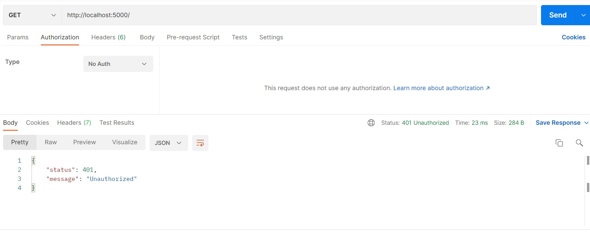

# unit-testing

**unit-testing** is the assignment submitted under training course Unit Testing in **Quantiphi**.

### Downloading the Code

* Go to (<https://github.com/kgayush/unit-testing>) and click on **Fork**
* You will be redirected to *your* fork, `https://github.com/<your_user_name>/unit-testing`
* Open the terminal, change to the directory where you want to clone the **unit-testing** repository
* Clone your repository using `git clone https://github.com/<your_user_name>/unit-testing`
* Enter the cloned directory using `cd unit-testing/`

### Software requirements

* Download NodeJS `https://nodejs.org/en/download/`
* Open the terminal, enter in **unit-testing** directory using `cd unit-testing/`
* Install libraries using `npm i basic-auth dotenv express`
* Install dev dependencies `npm i chai chai-http mocha --save-dev`
* Git

### Running Test Cases

* Write `mocha` in **test** script in **package.json** file.
* npm run test

### Screenshots

* Test Cases

 
 
* Public API

 
 
* Private API with No Auth

    
 
* Private API with Basic Auth
 
 
